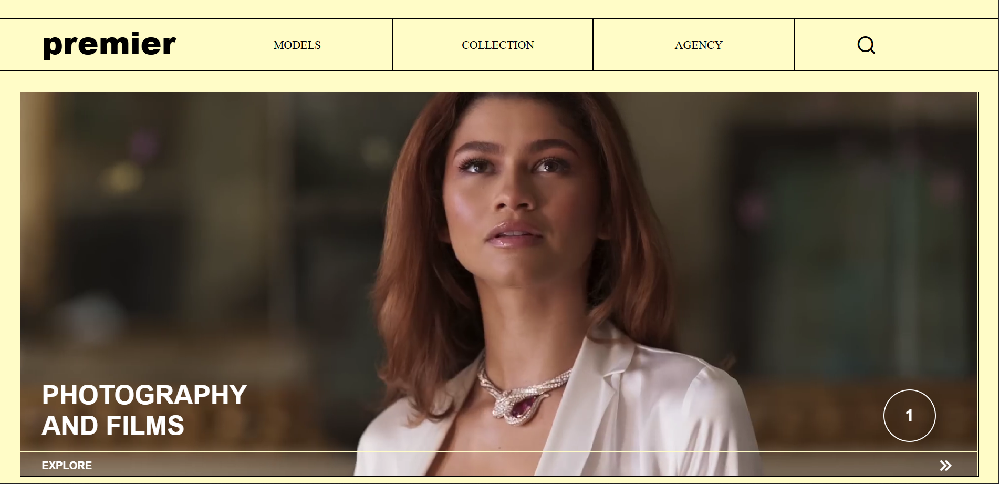
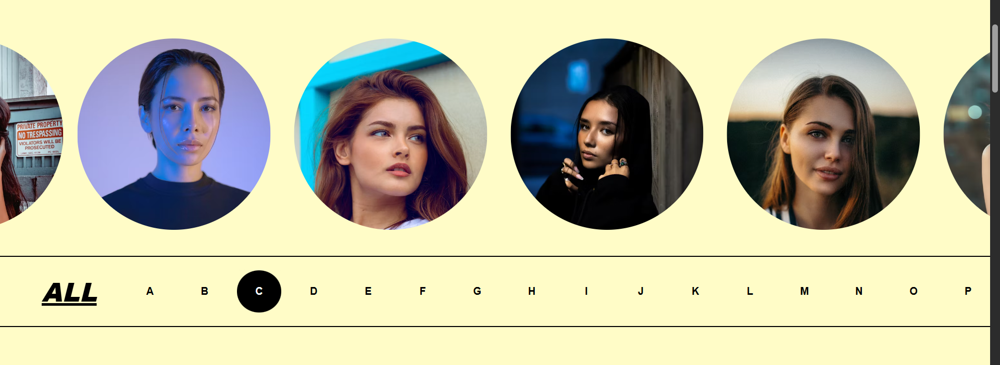
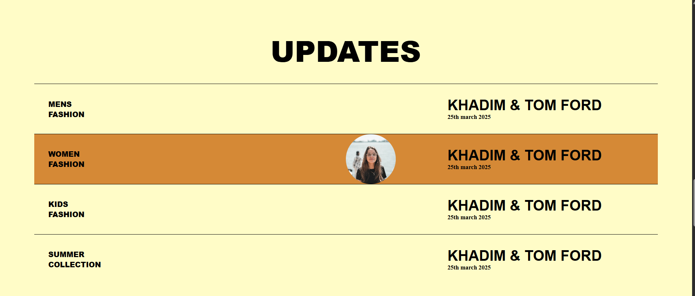
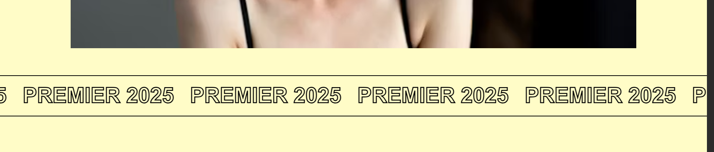
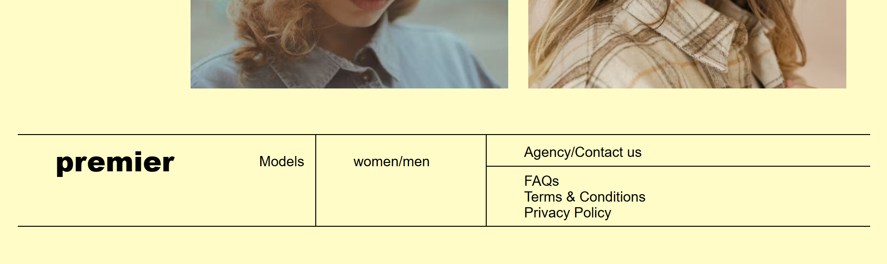

# 👗 Premier Fashion - Modern Women's Fashion Hub

✨ A luxurious and interactive fashion showcase built purely with **HTML** and **CSS**, featuring dynamic galleries, video banners, and responsive layouts for a modern women's fashion experience.

---

## 🔖 Badges

  
  
  
  
  
  

---

## 📸 Preview

---

## 🚀 Live Demo

Check out the live demo of this project here:  
🔗 [https://ayush-raghuwanshi-dev.github.io/PREMIER-FASHION/](https://ayush-raghuwanshi-dev.github.io/Premier-Fashion/)

---

## 🚀 Key Features

- ✅ Full-screen **video banner** for immersive brand introduction  
- 🖼️ **Infinite-scrolling image carousel** for collection display  
- 🔤 **A–Z interactive filter** for brand discovery  
- 🖱️ **Hover-based category reveals** with transitions  
- 📱 Mobile-first design for seamless responsiveness  
- 🎬 Motion banners & smooth page interactions  

---

## 🛠️ Tech Stack

| Technology   | Purpose                                |
|--------------|----------------------------------------|
| HTML5        | Page structure                         |
| CSS3         | Styling, animations & responsiveness   |
| Remix Icons  | Stylish and minimal icon usage         |

---

## 📱 Responsive Design

Built using mobile-first CSS principles and optimized for:  
- 📱 Mobile Devices  
- 💻 Tablets  
- 🖥️ Desktop Screens  

---

## 👨‍💻 Author

**Ayush Raghuwanshi**  
🎓 B.Tech CSE Student | 💅 Passionate Frontend Developer  
🌐 [GitHub Profile](https://github.com/Ayush-Raghuwanshi-Dev)

---

## 📄 License

  
This project is licensed under the [MIT License](./LICENSE).

---

*💖 Feel free to ⭐ the repository if you love fashion-focused frontend creativity!*
